# DB 設計

## users

| カラム名       | 型          | 制約・備考                       |
| -------------- | ----------- | -------------------------------- |
| id             | uuid        | PK / `DEFAULT gen_random_uuid()` |
| name           | text        | NOT NULL                         |
| email          | text        | NOT NULL / UNIQUE                |
| email_verified | boolean     | NOT NULL / `DEFAULT false`       |
| created_at     | timestamptz | NOT NULL / `DEFAULT now()`       |
| updated_at     | timestamptz | NOT NULL / トリガー更新          |

## contacts

| カラム名    | 型          | 制約・備考                           |
| ----------- | ----------- | ------------------------------------ |
| id          | uuid        | PK / `DEFAULT gen_random_uuid()`     |
| user_id     | uuid        | NOT NULL / FK → `users.id`（所有者） |
| name        | text        | NOT NULL                             |
| job         | text        | NULL 可                              |
| role        | text        | NULL 可                              |
| company     | text        | NULL 可                              |
| description | text        | NULL 可                              |
| created_at  | timestamptz | NOT NULL / `DEFAULT now()`           |
| updated_at  | timestamptz | NOT NULL / トリガー更新              |

※ 外部リンク等の可変情報は `contact_links` へ分離

## meetups

| カラム名     | 型          | 制約・備考                       |
| ------------ | ----------- | -------------------------------- |
| id           | uuid        | PK / `DEFAULT gen_random_uuid()` |
| user_id      | uuid        | NOT NULL / FK → `users.id`       |
| name         | text        | NOT NULL                         |
| scheduled_at | timestamptz | NOT NULL（開催/参加日時）        |
| created_at   | timestamptz | NOT NULL / `DEFAULT now()`       |
| updated_at   | timestamptz | NOT NULL / トリガー更新          |

## contact_meetups

| カラム名   | 型          | 制約・備考                                    |
| ---------- | ----------- | --------------------------------------------- |
| id         | uuid        | PK / `DEFAULT gen_random_uuid()`              |
| contact_id | uuid        | NOT NULL / FK → `contacts.id`                 |
| meetup_id  | uuid        | NOT NULL / FK → `meetups.id`                  |
| note       | text        | NULL 可（その出会いでのメモ）                |
| rating     | int         | NULL 可（評価など任意スコア）                |
| met_at     | timestamptz | NULL 可（当日の上書き用など）                |
| created_at | timestamptz | NOT NULL / `DEFAULT now()`                    |
| updated_at | timestamptz | NOT NULL / トリガー更新                       |

一意制約: `(contact_id, meetup_id)` を推奨（同一組合せは一意）

## tags

| カラム名   | 型          | 制約・備考                       |
| ---------- | ----------- | -------------------------------- |
| id         | uuid        | PK / `DEFAULT gen_random_uuid()` |
| user_id    | uuid        | NOT NULL / FK → `users.id`       |
| name       | text        | NOT NULL                         |
| created_at | timestamptz | NOT NULL / `DEFAULT now()`       |
| updated_at | timestamptz | NOT NULL / トリガー更新          |

一意制約（推奨）: `(user_id, name)` の複合一意

## contact_tags

| カラム名   | 型          | 制約・備考                       |
| ---------- | ----------- | -------------------------------- |
| id         | uuid        | PK / `DEFAULT gen_random_uuid()` |
| contact_id | uuid        | NOT NULL / FK → `contacts.id`    |
| tag_id     | uuid        | NOT NULL / FK → `tags.id`        |
| created_at | timestamptz | NOT NULL / `DEFAULT now()`       |
| updated_at | timestamptz | NOT NULL / トリガー更新          |

## profiles

| カラム名     | 型          | 制約・備考                 |
| ------------ | ----------- | -------------------------- |
| user_id      | uuid        | PK / FK → `users.id`       |
| name         | text        | NOT NULL                   |
| job          | text        | NULL 可                    |
| role         | text        | NULL 可                    |
| company      | text        | NULL 可                    |
| description  | text        | NULL 可                    |
| github_url   | text        | NULL 可                    |
| twitter_id   | text        | NULL 可                    |
| profile_url  | text        | NULL 可                    |
| product_name | text        | NULL 可                    |
| product_url  | text        | NULL 可                    |
| created_at   | timestamptz | NOT NULL / `DEFAULT now()` |
| updated_at   | timestamptz | NOT NULL / トリガー更新    |

```mermaid
erDiagram
    users ||--o{ contacts : registers
    users ||--o{ tags : creates
    users ||--|| profiles : has
    users ||--o{ meetups : owns
    meetups ||--o{ contact_meetups : includes
    contacts ||--o{ contact_meetups : attends
    contacts ||--o{ contact_tags : tagged
    contacts ||--o{ contact_links : links
    tags ||--o{ contact_tags : labels

    users {
        uuid id PK
        text name
        text email
        boolean email_verified
        timestamptz created_at
        timestamptz updated_at
    }

    meetups {
        uuid id PK
        uuid user_id FK
        text name
        timestamptz scheduled_at
        timestamptz created_at
        timestamptz updated_at
    }

    contacts {
        uuid id PK
        uuid user_id FK
        text name
        text job
        text role
        text company
        text description
        timestamptz created_at
        timestamptz updated_at
    }

    contact_meetups {
        uuid id PK
        uuid contact_id FK
        uuid meetup_id FK
        text note
        int rating
        timestamptz met_at
        timestamptz created_at
        timestamptz updated_at
    }

    tags {
        uuid id PK
        uuid user_id FK
        text name
        timestamptz created_at
        timestamptz updated_at
    }

    contact_tags {
        uuid id PK
        uuid contact_id FK
        uuid tag_id FK
        timestamptz created_at
        timestamptz updated_at
    }

    contact_links {
        uuid id PK
        uuid contact_id FK
        text type
        text label
        text url
        text handle
        timestamptz created_at
        timestamptz updated_at
    }

    profiles {
        uuid user_id PK
        text name
        text job
        text role
        text company
        text description
        text github_url
        text twitter_id
        text profile_url
        text product_name
        text product_url
        timestamptz created_at
        timestamptz updated_at
    }
```

補足
- `contacts` は恒久的な人物情報に限定し、外部リンクは `contact_links` に分離
- 出会いの文脈（メモ/評価/会った日時など）は `contact_meetups` に保持
- `tags` はユーザーごとに名前を一意にする運用を推奨
